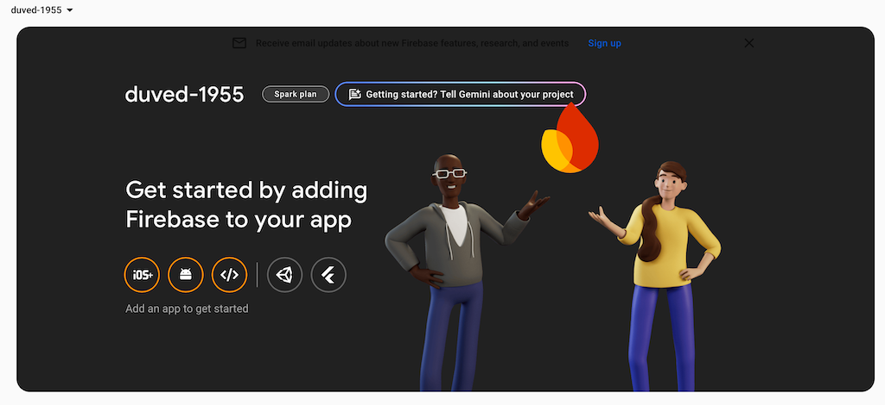
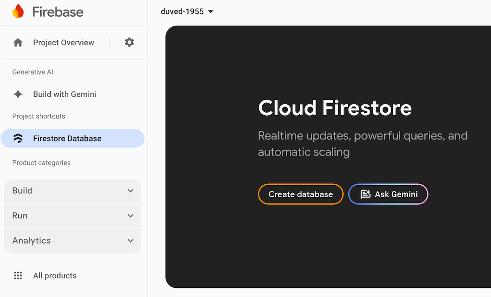
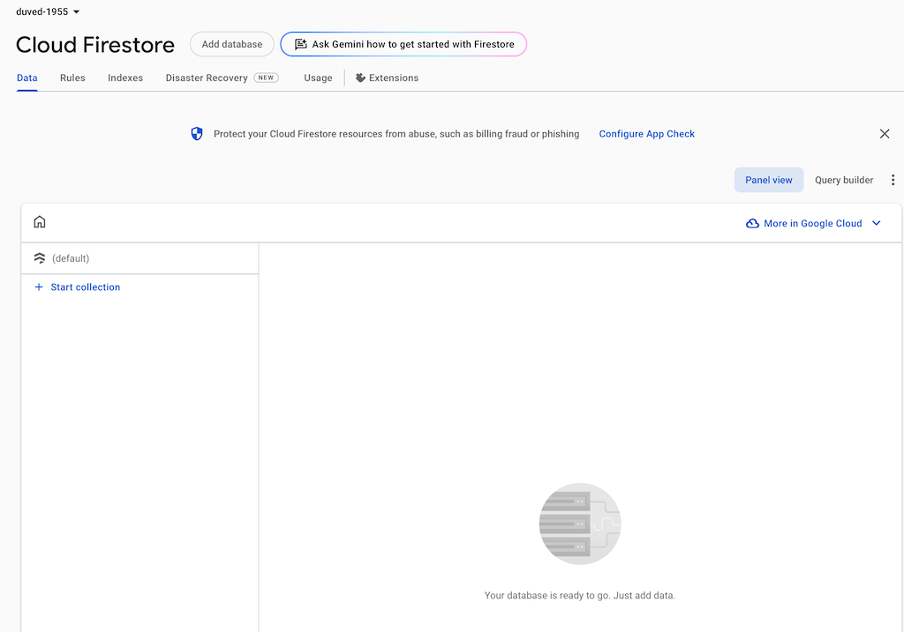
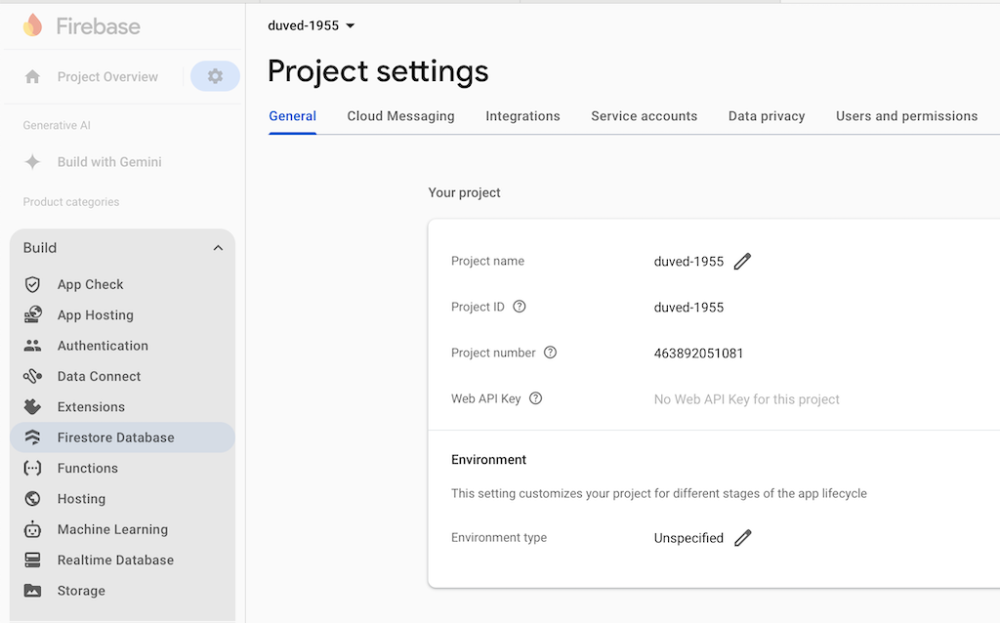
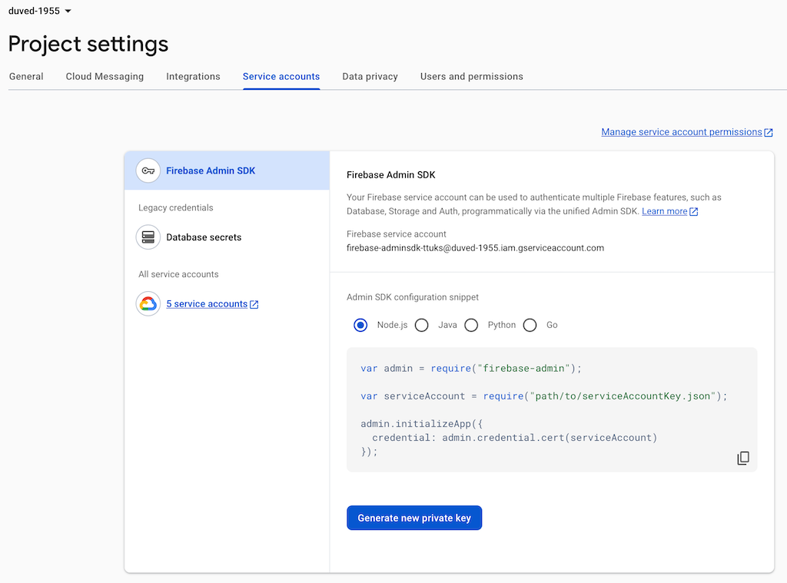
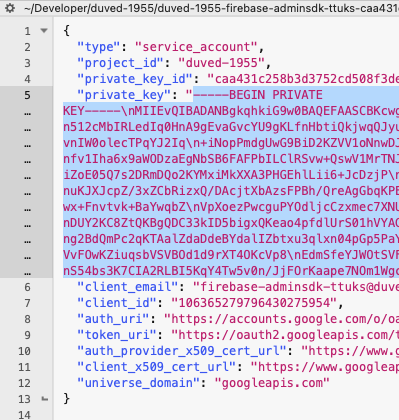
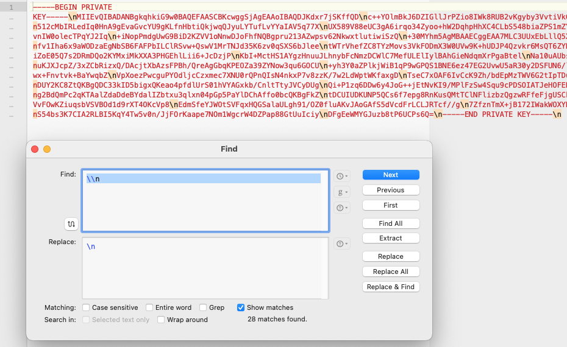
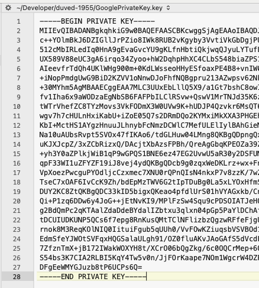
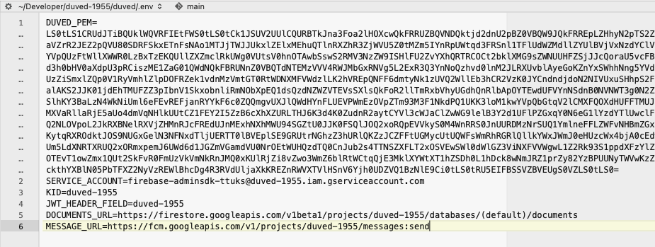

###### Published 2024-11-17
# Using Firestore from Vapor

## The project

I have successfully used Firestore as a database from Vapor, and decided I wanted to write a post on my personal blog about, mostly for my own sake to document every step in the process before I forget it. But if anyone else find this useful that would make me happy.

When I first researched the internet with the help of Google to find if anyone else have done something similar, I came across the post [Getting Started with Firebase for Server-Side Swift](https://medium.com/atlas/getting-started-with-firebase-for-server-side-swift-93c11098702a) by Tyler Milner. The JWT and Vapor part of the post was outdated, as he used Vapor 2 and an older version of jwt-kit. But I got a lot of useful information out of this post, and wanted to use the latest Vapor and jwt-kit to get the same result. And as Swift 6 is released now, I also wanted to use this even if it meant to having to grapple with Sendable protocol.

I wanted to make a reusable Swift package for the JWT signing of the Firestore, and release that as a public package for anyone that want to make a Vapor project connecting to Firestore much easier. I decided to name the package DuvedJWT.

## Setting up Firebase

You need to create a new project in Firebase, or use an existing on that you want to connect to. I decided to call my project duved-1955.


Click on **Firestore Database** in the sidebar, and then click the **Create database** button to create the Cloud Firestore.

After setting the location of your database, You will see an empty project.


Click project settings. This will open up the project settings window.


Click the **Service accounts** tab, and then **Generate new private key** button.


This will download a json file to your download folder. Open the json file with your favorite text editor, and find the private key value.



 Copy that text into a new window. If you inspect the file, you will see that there are a number of "\n" in the file. Use a find and replace tool in your text editor, and replace them with an newline (If you use BBEdit, use "\\\n" in the Find field, and "\n" in the Replace field).



I named the file GooglePrivateKey.key




Vapor expects to have the private key base64-encoded, so we will do that with this command:
`base64 -i GooglePrivateKey.key -o GooglePrivateKeyBase64.key`

Make a new .env file, and add a `DUVED_PEM` environment variable with the content of the base64 file we just created. 
Also add an environment variable for `SERVICE_ACCOUNT`,  `KID` and `DOCUMENTS_URL`. The `SERVICE_ACCOUNT` you can find in the downloaded json file, with the key `client_email`.
`KID` is the first part of the domain in the service account email address, and `DOCUMENTS_URL` should be like shown below, with the `KID` inserted in the middle of the URL:




## Setting up Vapor Swift Package

I have added [duvedjwt](https://github.com/imyrvold/duvedjwt) as a public Swift Package Library in my Github repository, that anyone can use in their Vapor or Hummingbird project. This library package can be used as a middleware to verify and sign jwt keys that we saved in the GooglePrivateKey_RSA.key file.

Created the library with the following commands:

> mkdir duvedjwt

> cd duvedjwt

> swift package init --type library

Then I added Vapor, JWT and JWTKit as dependencies in the Package.swift file.
The duvedjwt.swift file content I changed to the following:

```swift
import Vapor
import JWT

final public class duvedjwt: Middleware {
    
    public init() {}
    
    public func respond(to request: Request, chainingTo next: Responder) async throws -> FirebaseJWTPayload {
        try await request.firebaseJwt.verify()
    }

    public func respond(to request: Request, chainingTo next: Responder) -> EventLoopFuture<Response> {
        let promise = request.eventLoop.makePromise(of: Response.self)
        Task {
            do {
                let _ = try await request.firebaseJwt.verify()
                // Wait for the future to complete and get the actual Response
                let response = try await next.respond(to: request).get()
                promise.succeed(response)
            } catch {
                promise.fail(error)
            }
        }
        return promise.futureResult
    }
}
```

This is the middleware that will be used by the Request object in Vapor. Because Vapor still needs the EventLoopFuture version of the respond function to conform to the Middleware protocol, we need to include that. But we will be using the async version of the function in the library.
The function returns a FirebaseJWTPayload, so we need to add the FirebaseJWTPayload.

```swift
import JWTKit
import JWT
import Foundation

public struct FirebaseJWTPayload: JWTPayload {
    public func verify(using algorithm: some JWTKit.JWTAlgorithm) async throws {
        guard issuer.value.contains("securetoken.google.com") else {
            throw JWTError.claimVerificationFailure(failedClaim: IssuerClaim(value: issuer.value), reason: "Claim wasn't issued by Google")
        }
        guard subject.value.count <= 256 else {
            throw JWTError.claimVerificationFailure(failedClaim: SubjectClaim(value: subject.value), reason: "Subject claim beyond 255 ASCII characters long.")
        }
        try expirationAt.verifyNotExpired()
    }
    
    enum CodingKeys: String, CodingKey {
        case issuer = "iss"
        case subject = "sub"
        case audience = "aud"
        case issuedAt = "iat"
        case expirationAt = "exp"
        case email = "email"
        case userID = "user_id"
        case picture = "picture"
        case name = "name"
        case authTime = "auth_time"
        case isEmailVerified = "email_verified"
        case phoneNumber = "phone_number"
    }
    
    /// Issuer. It must be "https://securetoken.google.com/<projectId>", where <projectId> is the same project ID used for aud
    public let issuer: IssuerClaim
    
    /// Issued-at time. It must be in the past. The time is measured in seconds since the UNIX epoch.
    public let issuedAt: IssuedAtClaim
    
    /// Expiration time. It must be in the future. The time is measured in seconds since the UNIX epoch.
    public let expirationAt: ExpirationClaim
    
    /// The audience that this ID token is intended for. It must be your Firebase project ID, the unique identifier for your Firebase project, which can be found in the URL of that project's console.
    public let audience: AudienceClaim
    
    /// Subject. It must be a non-empty string and must be the uid of the user or device.
    public let subject: SubjectClaim
    
    /// Authentication time. It must be in the past. The time when the user authenticated.
    public let authTime: Date?
    
    public let userID: String
    public let email: String?
    public let picture: String?
    public let name: String?
    public let isEmailVerified: Bool?
    public let phoneNumber: String?
}
```
This is the jwt payload that Firebase uses in its REST API's. We can verify that the token is issued by Google in the verify function, and that the token has not expired.

To be able to use the verify in the application object, we need to extend Application:

```swift
import Vapor
import JWTKit
import JWT

extension Application {
    public var firebaseJwt: FirebaseJWT {
        .init(application: self)
    }
    
    public struct FirebaseJWT {
        let application: Application
        
        public func signers(on request: Request) async throws -> JWTKeyCollection {
            try await withCheckedThrowingContinuation { continuation in
                self.jwks.get(on: request).flatMapThrowing { jwks in
                    // Assuming `add(jwks:)` is an async function
                    Task {
                        let collection = try await JWTKeyCollection().add(jwks: jwks)
                        continuation.resume(returning: collection)
                    }
                }.whenFailure { error in
                    continuation.resume(throwing: error)
                }
            }
        }
        
        public var jwks: EndpointCache<JWKS> {
            self.storage.jwks
        }
        
        public var applicationIdentifier: String? {
            get {
                self.storage.applicationIdentifier
            }
            nonmutating set {
                self.storage.applicationIdentifier = newValue
            }
        }
        
        private struct Key: StorageKey, LockKey {
            typealias Value = Storage
        }

        private final class Storage: @unchecked Sendable {
            let jwks: EndpointCache<JWKS>
            var applicationIdentifier: String?
            var gSuiteDomainName: String?
            init() {
                self.jwks = .init(uri: "https://www.googleapis.com/service_accounts/v1/jwk/securetoken@system.gserviceaccount.com")
                self.applicationIdentifier = nil
                self.gSuiteDomainName = nil
            }
        }
        
        private var storage: Storage {
            if let existing = self.application.storage[Key.self] {
                return existing
            } else {
                let lock = self.application.locks.lock(for: Key.self)
                lock.lock()
                defer { lock.unlock() }
                if let existing = self.application.storage[Key.self] {
                    return existing
                }
                let new = Storage()
                self.application.storage[Key.self] = new
                return new
            }
        }
    }
}
```

And at last we need to extend the Request object:

```
import Vapor
import JWTKit

extension Request {
    public var firebaseJwt: FirebaseJWT {
        .init(request: self)
    }
    
    public struct FirebaseJWT {
        let request: Request
        
        public func verify(applicationIdentifier: String? = nil) async throws -> FirebaseJWTPayload {
            guard let token = self.request.headers.bearerAuthorization?.token else {
                self.request.logger.error("Request is missing JWT bearer header.")
                throw Abort(.unauthorized)
            }
            return try await self.verify(token, applicationIdentifier: applicationIdentifier)
        }

        
        public func verify(_ message: String, applicationIdentifier: String? = nil ) async throws -> FirebaseJWTPayload {
            try await self.verify([UInt8](message.utf8), applicationIdentifier: applicationIdentifier)
        }
        
        public func verify<Message: Sendable>(_ message: Message, applicationIdentifier: String? = nil) async throws -> FirebaseJWTPayload where Message: DataProtocol {
            let signers = try await self.request.application.firebaseJwt.signers(on: self.request)
            let token = try await signers.verify(message, as: FirebaseJWTPayload.self)
            if let applicationIdentifier {
                try token.audience.verifyIntendedAudience(includes: applicationIdentifier)
            }
            return token
        }
    }
}
```

# Make the Vapor main app

We can now proceed to create the Vapor main app:

> vapor new duved -n

Open the Package.swift, and add the Swift package duvedjwt that we just created.

```swift
// swift-tools-version:6.0
import PackageDescription

let package = Package(
    name: "duved",
    platforms: [
       .macOS(.v15)
    ],
    dependencies: [
        .package(url: "https://github.com/vapor/vapor.git", from: "4.99.3"),
        .package(url: "https://github.com/apple/swift-nio.git", from: "2.65.0"),
        .package(url: "https://github.com/imyrvold/duvedjwt.git", branch: "main"),
    ],
    targets: [
        .executableTarget(
            name: "App",
            dependencies: [
                .product(name: "Vapor", package: "vapor"),
                .product(name: "NIOCore", package: "swift-nio"),
                .product(name: "NIOPosix", package: "swift-nio"),
                .product(name: "duvedjwt", package: "duvedjwt"),
            ],
            swiftSettings: swiftSettings
        ),
        .testTarget(
            name: "AppTests",
            dependencies: [
                .target(name: "App"),
                .product(name: "XCTVapor", package: "vapor"),
            ],
            swiftSettings: swiftSettings
        )
    ],
    swiftLanguageModes: [.v5]
)

var swiftSettings: [SwiftSetting] { [
    .enableUpcomingFeature("DisableOutwardActorInference"),
    .enableExperimentalFeature("StrictConcurrency"),
] }
```


As you can see, we have added depemdemcies to Vapor and the duvedjwt package I created above. This will help us creating a Vapor app that we will use to communicate with Firestore.

## Configure duved app

Open the configure.swift file, and add the `DUVED_PEM` key that we will fetch using Vapor's `Environment.get()` function. 
This key will fetched from Google Cloud's Secret Manager when we run Vapor in Google Cloud, and will be fetched from .env file when we run the Vapor locally with Xcode.

```swift
import Vapor
import AsyncHTTPClient

public func configure(_ app: Application) async throws {
        
    guard let duvedKey = Environment.get("DUVED_PEM") else { fatalError("No value was found at the given public key environment 'DUVED_PEM'") }
    guard let privateKey = duvedKey.base64Decoded() else { fatalError("Failed to decode 'DUVED_PEM'") }

    app.duvedConfiguration = .init(pem: privateKey)
    app.fire.client = HTTPClient(eventLoopGroupProvider: .singleton)

    try routes(app)

}
```

The `duvedKey` is base64 encoded, so that we need to decode it to get the private key. We can see that we initialized a configuration object we have named `duvedConfiguration`, which have been added to the app itself using Vapor's `Storage`.
This makes it very convenient to access the object from the app object itself.
We need to create the configuration. Add a new file in the Sources/App group named DuvedConfiguration.

```swift
import Vapor
import JWT

struct DuvedConfiguration {
    let pem: String
    let serviceAccount: String
    let documentsUrl: URL
    let messageUrl: URL
    let kid: JWKIdentifier
    let jwtHeaderField: JWTHeaderField
    var tokenResult: TokenResult?
    var messageTokenResult: TokenResult?

    var expired: Bool {
        guard let tokenResult, let expireTime = tokenResult.expireTime else { return true }
        return expireTime <= Date.now
    }
    var messageTokenExpired: Bool {
        guard let messageTokenResult, let expireTime = messageTokenResult.expireTime else { return true }
        return expireTime <= Date.now
    }

    init(pem: String) {
        self.pem = pem
        guard let serviceAccount = Environment.get("SERVICE_ACCOUNT") else { fatalError("No value was found at the given public key environment 'SERVICE_ACCOUNT'") }
        guard let documentsUrlString = Environment.get("DOCUMENTS_URL") else { fatalError("No value was found at the given public key environment 'DOCUMENTS_URL'") }
        guard let messageUrlString = Environment.get("MESSAGE_URL") else { fatalError("No value was found at the given public key environment 'MESSAGE_URL'") }
        guard let kidString = Environment.get("KID") else { fatalError("No value was found at the given public key environment 'KID'") }
        guard let jwtHeaderFieldString = Environment.get("JWT_HEADER_FIELD") else { fatalError("No value was found at the given public key environment 'JWT_HEADER_FIELD'") }

        self.serviceAccount = serviceAccount
        documentsUrl = URL(string: documentsUrlString)!
        messageUrl = URL(string: messageUrlString)!
        kid = JWKIdentifier(string: kidString)
        jwtHeaderField = JWTHeaderField(stringLiteral: jwtHeaderFieldString)
        tokenResult = nil
        messageTokenResult = nil
    }
}

struct DuvedConfigurationKey: StorageKey {
    typealias Value = DuvedConfiguration
}
```

We see that the properties of the DuvedConfiguration object consists of pem, serviceAccount, documentsUrl etc.
There are also a few other secrets that we need to store in Google Cloud's Secret Manager and the .env file.

We need to add DuvedConfiguration to the Application itself. We add the file Application+Storage file in a new Extensions group.

```swift
import Foundation
import Vapor
import AsyncHTTPClient

extension Application {
    var duvedConfiguration: DuvedConfiguration? {
        get { self.storage[DuvedConfigurationKey.self] }
        set { self.storage[DuvedConfigurationKey.self] = newValue }
    }
    
    var fire: Fire {
        .init(application: self)
    }
    
    struct Fire {
        struct ClientKey: StorageKey {
            typealias Value = HTTPClient
        }
        
        var client: HTTPClient {
            get {
                guard let client = self.application.storage[ClientKey.self] else {
                    fatalError("HTTPClient not setup. Use application.fire.client = ...")
                }
                return client
            }
            nonmutating set {
                self.application.storage.set(ClientKey.self, to: newValue) {
                    try $0.syncShutdown()
                }
            }
        }
        let application: Application
    }
}

public extension Request {
    var fire: Fire {
        .init(request: self)
    }
    
    struct Fire {
        var client: HTTPClient {
            request.application.fire.client
        }
        let request: Request
    }
}

```

We also need to add an extension to String, for decoding a base 64 String. Add a file String+base64Decoded to the extensions group.

```swift
import Foundation

extension String {
    func base64Decoded() -> String? {
        guard let data = Data(base64Encoded: self) else { return nil }
        return String(data: data, encoding: .utf8)
    }
}
```

Finally, add a Models group to App group, and then a Firestore group to the Models group. In the Firestore group, add a TokenResult.swift file.

```swift
import Foundation

enum TokenType: String, Decodable {
    case bearer = "Bearer"
}

struct TokenResult: Decodable {
    let accessToken: String
    let expiresIn: Int
    let tokenType: TokenType
    var expireTime: Date?
    
    enum CodingKeys: String, CodingKey {
        case accessToken
        case expiresIn
        case tokenType
    }
}
```

TokenResult object is used in DuvedConfiguration.

## APICall and Endpoint
Whenever I make a new Vapor app, I make an APICall object and an Endpoint enum, to make it more convenient to make API endpoints used in the app.

Make a Utility folder under the App folder in Xcode, and add three files, APICall.swift, Client.swift and Endpoint.swift.
The APICall model have two methods, `getData(req:)` and `makeRequest(req:)` methods, the first is for making an API call to Firestore, and expects Data that needs to be decoded in response. The second method is for API call to Firestore where we expects no data in return.

The third method in APICall is `token(for:req:isMessage)`, which we will use to make a token so that our API call to Firestore will be accepted as an authenticated API call.
We are using DuvedConfiguration to create the token.

```swift
import Foundation
import AsyncHTTPClient
import Vapor

public enum RequestType: String {
    case GET, POST, PATCH, DELETE
}

struct APICall {
    let method: RequestType
    let endpoint: Endpoint
    let parameters: [String: Any]
    let httpBody: Data?
    let queryItems: [URLQueryItem]?
    
    init(method: RequestType, endpoint: Endpoint, parameters: [String: Any] = [:], queryItems: [URLQueryItem]? = nil, httpBody: Data? = nil) {
        self.method = method
        self.endpoint = endpoint
        self.parameters = parameters
        self.httpBody = httpBody
        self.queryItems = queryItems
    }
}
extension APICall {
    
    func getData(req: Request) async throws -> Data {
        guard let configuration = req.application.fishConfiguration else { throw Abort(.badRequest) }
        guard let tokenResult = try await token(for: configuration, req: req, isMessage: endpoint.isMessage) else { throw Abort(.badRequest) }
        let url = endpoint.url(with: endpoint.isMessage ? configuration.messageUrl : configuration.documentsUrl)
        guard var urlComponents = URLComponents(url: url, resolvingAgainstBaseURL: true) else { throw Abort(.badRequest) }
        urlComponents.queryItems = queryItems
        guard let url = urlComponents.url?.absoluteString else { throw Abort(.badRequest) }
        var request = HTTPClientRequest(url: url)
        switch method {
        case .GET:
            request.method = .GET
        case .POST:
            request.method = .POST
        case .PATCH:
            request.method = .PATCH
        case .DELETE:
            request.method = .DELETE
        }
        request.headers = .init([("Content-Type", "application/json"), ("Authorization", "Bearer \(tokenResult.accessToken)")])

        if let httpBody {
            request.body = .bytes(httpBody)
        }
        let response = try await req.fire.client.execute(request, timeout: .seconds(5))
        let responseBody = try await response.body.collect(upTo: 1024 * 1024)
        let data = Data(buffer: responseBody)
        return data
    }
    
    func makeRequest(req: Request) async throws {
        guard let configuration = req.application.fishConfiguration else { throw Abort(.badRequest) }
        guard let tokenResult = try await token(for: configuration, req: req, isMessage: endpoint.isMessage) else { throw Abort(.badRequest) }
        let url = endpoint.url(with: endpoint.isMessage ? configuration.messageUrl : configuration.documentsUrl)
        guard var urlComponents = URLComponents(url: url, resolvingAgainstBaseURL: true) else { throw Abort(.badRequest) }
        urlComponents.queryItems = queryItems
        guard let url = urlComponents.url?.absoluteString else { throw Abort(.badRequest) }
        var request = HTTPClientRequest(url: url)
        switch method {
        case .GET:
            request.method = .GET
        case .POST:
            request.method = .POST
        case .PATCH:
            request.method = .PATCH
        case .DELETE:
            request.method = .DELETE
        }
        request.headers = .init([("Content-Type", "application/json"), ("Authorization", "Bearer \(tokenResult.accessToken)")])

        if let httpBody {
            request.body = .bytes(httpBody)
        }
        _ = try await req.fire.client.execute(request, timeout: .seconds(5))
    }
    
    func token(for configuration: FishConfiguration, req: Request, isMessage: Bool = false) async throws -> TokenResult? {
        guard let jwt = try await JWTToken.createJWT(for: configuration, isMessage: isMessage) else {
            print("Failed to create JWT")
            return nil
        }
        let tokenResult = isMessage ? configuration.messageTokenResult : configuration.tokenResult
        let expired = isMessage ? configuration.messageTokenExpired : configuration.expired
        if !expired {
            return tokenResult
        }
        let token = try await JWTToken.fetchToken(with: jwt, req: req)
        
        if isMessage {
            req.application.fishConfiguration?.messageTokenResult = token
        } else {
            req.application.fishConfiguration?.tokenResult = token
        }
        return token
    }

}
```

The `token(for:req:isMessage)` method creates a jwt object using `JWTToken`. We need to add this file. Create a new file under the folders App/Models/Firestore with name `JWTToken.swift`.
```swift
import JWT
import JWTKit
import AsyncHTTPClient
import Vapor

struct JWTToken {
    static func createJWT(for configuration: DuvedConfiguration, isMessage: Bool = false) async throws -> String? {
        guard let time = Calendar.current.date(byAdding: .minute, value: 30, to: Date.now) else { return nil }
        let scope = isMessage ? "https://www.googleapis.com/auth/firebase.messaging" : "https://www.googleapis.com/auth/datastore"
        let payload = FirestorePayload(expiration: .init(value: time), issuedAt: .init(value: .now), issuer: .init(value: configuration.serviceAccount), audience: .init(value: ["https://www.googleapis.com/oauth2/v4/token"]), scope: scope)
        
        let keys = JWTKeyCollection()
        let key = try Insecure.RSA.PrivateKey(pem: configuration.pem)
        await keys.add(rsa: key, digestAlgorithm: .sha256, kid: configuration.kid)

        return try await keys.sign(payload, header: ["kid": configuration.jwtHeaderField])
    }
        
    static func fetchToken(with jwt: String, req: Request) async throws -> TokenResult {
        guard let duvedConfiguration = req.application.duvedConfiguration else { fatalError("DuvedAppConfiguration is not set up") }
        var request = HTTPClientRequest(url: "https://www.googleapis.com/oauth2/v4/token")
        request.method = .POST
        request.headers = .init([("Content-Type", "application/x-www-form-urlencoded")])
        request.body = .bytes(.init(string: "grant_type=urn:ietf:params:oauth:grant-type:jwt-bearer&assertion=\(jwt)"))
        let response = try await req.fire.client.execute(request, timeout: .seconds(5))
        let responseBody = try await response.body.collect(upTo: 1024 * 1024)
        let decoder = JSONDecoder()
        decoder.keyDecodingStrategy = .convertFromSnakeCase
        var result = try decoder.decode(TokenResult.self, from: responseBody)
        result.expireTime = Calendar.current.date(byAdding: .second, value: result.expiresIn, to: Date.now)
        return result
    }
}
```

This file uses FirestorePayload model, which is a JWTPayload that we use to create a token so that we can use authenticated API calls to Firestore rest APIs.
Create the file FirestorePayload.swift under the folders App/Models/Firestore.

```swift
import Foundation
import JWT

struct FirestorePayload: JWTPayload {
    enum CodingKeys: String, CodingKey {
        case expiration = "exp"
        case issuedAt = "iat"
        case issuer = "iss"
        case audience = "aud"
        case scope
    }
    var expiration: ExpirationClaim
    var issuedAt: IssuedAtClaim
    var issuer: IssuerClaim
    var audience: AudienceClaim
    var scope: String
    
    func verify(using algorithm: some JWTKit.JWTAlgorithm) async throws {
        try self.expiration.verifyNotExpired()
    }
    
}
```

Client.swift contains the AsyncHTTPClient used to make authenticated API calls to Firestore.

```swift
import AsyncHTTPClient
import Vapor

struct Client<ResourceType> where ResourceType: Decodable {
    let decoder = JSONDecoder()
    let method: RequestType
    let endpoint: Endpoint
    let queryItems: [URLQueryItem]?
    let httpBody: Data?
    let dateFormatter: DateFormatter?

    init(method: RequestType, endpoint: Endpoint, queryItems: [URLQueryItem]? = nil, httpBody: Data? = nil, dateFormatter: DateFormatter? = nil) {
        self.method = method
        self.endpoint = endpoint
        self.queryItems = queryItems
        self.httpBody = httpBody
        self.dateFormatter = dateFormatter
    }

    mutating func getData(req: Request) async throws -> ResourceType {
        if let dateFormatter {
            decoder.dateDecodingStrategy = .formatted(dateFormatter)
        } else {
            let dateFormatter = DateFormatter()
            dateFormatter.dateFormat = "yyyy-MM-dd'T'HH:mm:ss.SSS'Z'"
            decoder.dateDecodingStrategy = .formatted(dateFormatter)
        }
        let call = APICall(method: method, endpoint: endpoint, queryItems: queryItems, httpBody: httpBody)
        let data = try await call.getData(req: req)
        if ResourceType.self == Data.self {
            return data as! ResourceType
        } 
        let resource = try decoder.decode(ResourceType.self, from: data)

        return resource
    }
    
    func makeRequest(req: Request) async throws {
        if let dateFormatter {
            decoder.dateDecodingStrategy = .formatted(dateFormatter)
        } else {
            decoder.dateDecodingStrategy = .iso8601
        }
        let call = APICall(method: method, endpoint: endpoint, queryItems: queryItems, httpBody: httpBody)
        try await call.makeRequest(req: req)
    }

}
```

The Endpoint.swift file contains all the endpoints we will use in this Vapor app. We start with a couple endpoint, to test out if it works.

```swift
enum Endpoint {
    case createUser(name: String, address: String)
    case users

    var isMessage: Bool {
        switch self {
        case .createUser, .users:
            return false
        default:
            return true
        }
    }
    
    func url(with baseUrl: URL) -> URL {
        switch self {
        case .createUser(let name, let address):
            return baseUrl.appendingPathComponent("users")
        case .users:
            return baseUrl.appendingPathComponent("users")
        }
    }
}
```

## UserFireService
I find it convenient to encapsulate all API calls to Firestore collections in fire service models. For the `users` collection, we will create a `UserFireService.swift` file in a new folder App/FireServices.

```swift
import Vapor

struct UserFireService {
    let request: Request
    var dateFormatter: DateFormatter {
        let dateFormatter = DateFormatter()
        dateFormatter.dateFormat = "yyyy-MM-dd'T'HH:mm:ss.SSS'Z'"
        return dateFormatter
    }
    var decoder: JSONDecoder {
        let decoder = JSONDecoder()
        
        decoder.dateDecodingStrategy = .formatted(dateFormatter)
        return decoder
    }
}
```

## UserController
We will create a new file under the Controllers folder, called UserController.swift, that we will use to serve API calls to the Vapor app.
